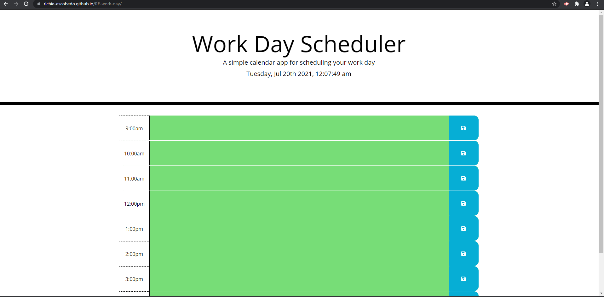

# RE Work Day Scheduler

## Description
Application that allows users to plan out their workday by saving their tasks and color coding them based on whether the time for the task has past, is occuring, or is pending. Furthermore, the application is based off HTML and CSS and powered by JavaScript with a bootstrap component. Additionally, the application used moment.js, which is in the JavaScript library, to capture time. Finally, the use of the localStorage will allow users to store their data on the browser until the page is restarted.

## Screenshot of Deployed Application

## Link to Deployed Application 
[Launch Work Day Scheduler](https://richie-escobedo.github.io/RE-work-day/)
